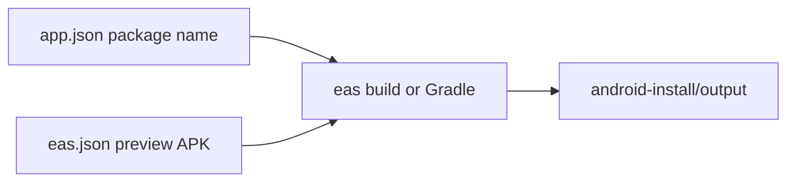

# Android 安装包与 `android-install/` 目录

## 目标

- 产出可在安卓手机上**侧载安装**的包（优先 **APK**，便于复制分发；上架商店再用 AAB 可后续加 profile）。
- 新建文件夹 `**[android-install/](c:\Users\31215\Desktop\ai-assistant\work\android-install)`**：放**中文说明**、可选 `**output/`** 占位（构建完成后把 `.apk` 复制到此，便于统一管理）。
- 游戏本身已是单机逻辑、无服务端依赖；发布包不依赖 Expo Go，安装后**纯本地**运行（与是否声明 `INTERNET` 权限无关，当前合集无联网玩法）。

## 1. 修正应用标识（打包前必做）

当前 `[app.json](c:\Users\31215\Desktop\ai-assistant\work\app.json)` 中 `name` / `slug` / `scheme` 仍为 `__scaffold__`，不适合上架或长期维护。

- 将 `expo.name` 改为面向用户的中文名（如「小游戏合集」）。
- 将 `slug`、`scheme` 改为**仅字母数字与连字符**（如 `mini-games-hub`），避免工具链问题。
- 在 `expo.android` 增加 `**package`**（唯一 Application ID），例如 `com.yourname.minigames`（请按你域名/习惯改成全局唯一字符串；计划实施时用占位并在 README 中提示可改）。

## 2. 根目录增加 EAS 配置（推荐打 APK）

在仓库根目录新增 `[eas.json](c:\Users\31215\Desktop\ai-assistant\work\eas.json)`：

- `**preview`**（或 `apk`）profile：`"android": { "buildType": "apk" }`，便于直接得到 APK 下载链接或本地拉取后复制到 `android-install/output/`。
- 可选 `**production`**：`buildType` 默认 AAB，供以后上架 Google Play。

首次使用需在项目根执行 `npx eas-cli login` / `eas init`（关联 Expo 账号与项目 ID），再在 `[package.json](c:\Users\31215\Desktop\ai-assistant\work\package.json)` 增加脚本，例如 `"build:android:apk": "eas build -p android --profile preview"`。

说明：EAS Build 在云端完成签名与编译，**需要网络与 Expo 账号**；产物为**已签名安装包**，用户手机开启「允许安装未知来源」即可安装。

## 3. 新建 `android-install/` 目录内容

| 文件                                                                                                            | 作用                                                                            |
| ------------------------------------------------------------------------------------------------------------- | ----------------------------------------------------------------------------- |
| `[android-install/README.md](c:\Users\31215\Desktop\ai-assistant\work\android-install/README.md)`             | 中文：环境要求、EAS 打 APK 步骤、本机 Gradle 备选步骤、将 APK 放到 `output/` 的说明、常见问题（包名修改、仅单机）     |
| `[android-install/output/.gitkeep](c:\Users\31215\Desktop\ai-assistant\work\android-install\output\.gitkeep)` | 空目录占位；**大文件 APK 建议加入根目录 `.gitignore` 的 `android-install/output/*.apk`**，避免误提交 |

根目录 `[.gitignore](c:\Users\31215\Desktop\ai-assistant\work\.gitignore)` 增加忽略规则（若尚未忽略）：`android-install/output/*.apk`、`android-install/output/*.aab`。

## 4. 备选：完全本机生成 APK（无 EAS 云）

适合已安装 **Android Studio / JDK / SDK** 的环境：

1. `npx expo prebuild --platform android`（生成 `android/` 原生工程；首次会创建目录，后续可纳入版本控制或按团队策略忽略）。
2. `cd android && ./gradlew assembleRelease`（Windows 可用 `gradlew.bat`）。
3. 默认 APK 路径：`android/app/build/outputs/apk/release/app-release.apk`；复制到 `android-install/output/`。

注意：Release 默认可能使用 debug keystore 或需配置 `signingConfig`；README 中写明「正式发布需配置自己的 keystore」，第一版侧载可用 EAS 托管凭据或本地 debug 说明。

## 5. 文档串联

在根 `[README.md](c:\Users\31215\Desktop\ai-assistant\work\README.md)` 增加一小节 **「Android 安装包」**，链接到 `android-install/README.md`，避免主 README 过长。

## 6. 验收

- 配置与文档齐全后，在文档中列出一条可复制的命令链（至少 EAS 路径）。
- 任选一种方式成功产出至少一次 **APK**（若当前环境无 Android SDK，则以 `eas build` 云端成功或文档级验收 + 本地 `tsc` 通过为准，并在 README 标明「需在 Expo 控制台下载 artifact」）。

## 范围外

- 国内应用商店（华为/小米等）各自上架材料与渠道包。
- iOS IPA。

