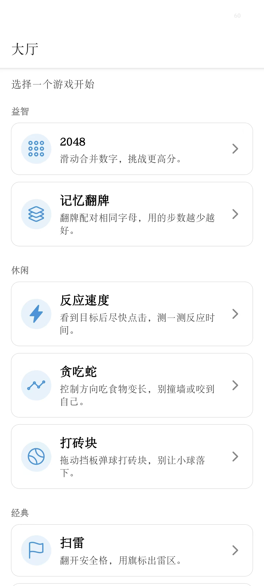
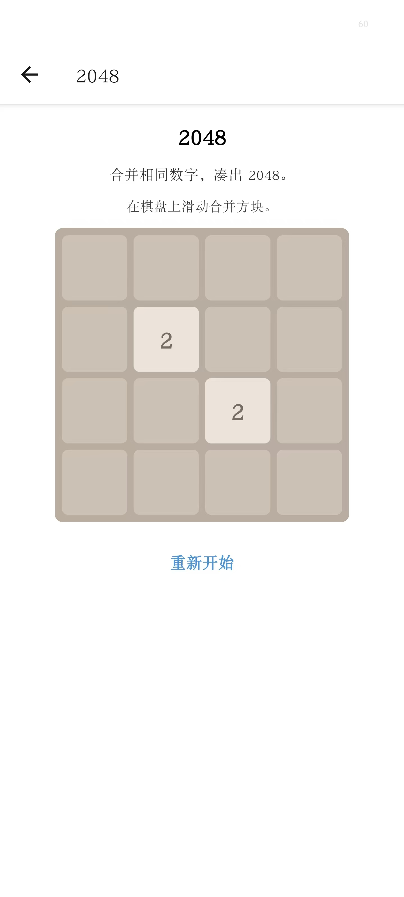
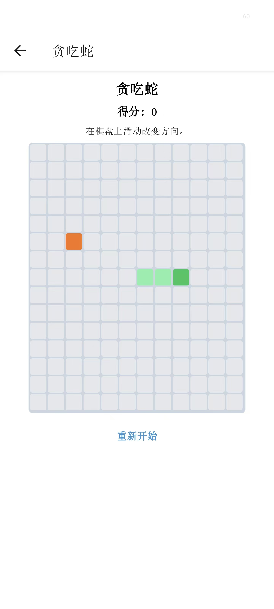
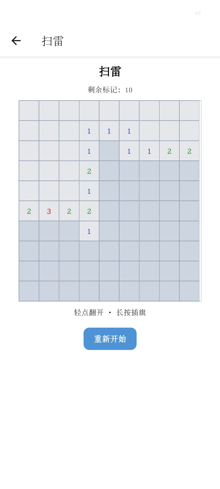
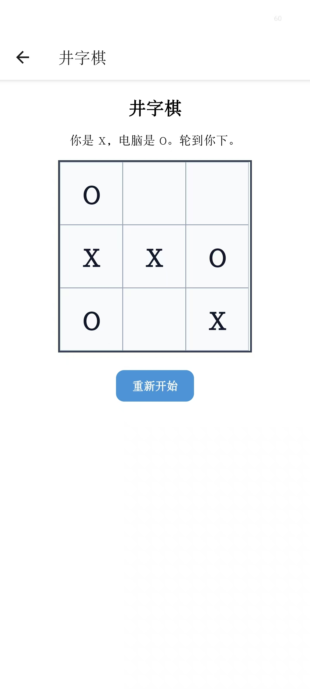

# 小游戏合集 (Mini Games Hub)

[](https://expo.dev)
[](https://reactnative.dev)
[](https://www.typescriptlang.org)
[](https://react.dev)

一个基于 Expo / React Native 构建的小游戏合集，内置 **8 款经典小游戏**，配有统一的游戏大厅和 Expo Router 导航。界面文案为中文，支持 Android、iOS、Web 三端运行，完全离线可用。

---

## 功能亮点

- **8 款全屏小游戏** — 每款游戏都是独立的全屏组件，自带纯逻辑模块，互不耦合
- **分类大厅** — 使用 `SectionList` 按类别（益智 / 休闲 / 经典）分组展示，一目了然
- **Expo Router 导航** — 基于文件系统的 Stack 路由，大厅点击即进入游戏，栈顶自动提供返回按钮
- **中文界面** — 所有壳层文案集中管理在 `src/i18n/zh.ts`，游戏内文案也统一为中文
- **滑动手势支持** — `SwipeSurface` 组件封装 `PanResponder`，为 2048 和贪吃蛇提供方向滑动，无需屏幕方向键
- **暗色模式** — `Themed` 组件随系统色彩方案自动切换明暗主题，基于 `@react-navigation/native` 的 `ThemeProvider`
- **完全离线** — 所有游戏逻辑在客户端运行，无需任何网络请求或后端服务
- **三端运行** — Android（APK/AAB）、iOS（Expo Go / 模拟器）、Web（静态导出）

---

## 游戏目录

| # | 游戏 | ID | 分类 | 图标 | 操作 | 简介 |
|---|------|----|------|------|------|------|
| 1 | **2048** | `twenty48` | 益智 | `apps-outline` | 滑动 | 4×4 网格，合并相同数字，目标达到 2048 |
| 2 | **反应速度** | `reaction-time` | 休闲 | `flash` | 点击 | 等待绿色圆圈出现，以最快速度点击，测试毫秒级反应 |
| 3 | **贪吃蛇** | `snake` | 休闲 | `analytics-outline` | 滑动 | 12×15 网格经典贪吃蛇，吃食物变长，勿撞墙或咬到自己 |
| 4 | **扫雷** | `minesweeper` | 经典 | `flag-outline` | 点击/长按 | 9×10 棋盘，10 颗雷，点击翻格、长按插旗 |
| 5 | **井字棋** | `tictactoe` | 经典 | `grid-outline` | 点击 | 3×3 棋盘，玩家（X）对战 AI（O），AI 策略：先胜后堵再随机 |
| 6 | **记忆翻牌** | `memory` | 益智 | `layers-outline` | 点击 | 4×4（8 对字母 A-H），翻开配对，步数越少越好 |
| 7 | **打砖块** | `breakout` | 休闲 | `tennisball-outline` | 拖动挡板 | 经典弹球打砖，4×6 砖块阵，别让球落下 |
| 8 | **西蒙说** | `simon` | 经典 | `musical-notes-outline` | 点击色块 | 记住并重复颜色序列（红/绿/蓝/黄），回合越来越长 |

---

## 截图

> 可在大厅和各游戏界面截图后放置于 `screenshots/` 目录。

| 大厅 | 2048 | 贪吃蛇 | 扫雷 |
|------|------|--------|------|
|  |  |  |  |

| 井字棋 | 记忆翻牌 | 打砖块 | 西蒙说 |
|--------|----------|--------|--------|
|  |  |  |  |

---

## 技术栈

| 层级 | 技术 | 版本 |
|------|------|------|
| 框架 | React Native | 0.81.5 |
| UI 库 | React | 19.1.0 |
| 构建工具 | Expo SDK | 54 |
| 导航 | Expo Router (Stack) | ~6.0 |
| 语言 | TypeScript | ~5.9 |
| 动画/手势 | react-native-reanimated | ~4.1 |
| 图标 | @expo/vector-icons (Ionicons) | ^15.0 |
| Web 目标 | react-native-web | ~0.21 |
| 云端构建 | EAS CLI | ^16.28 |

---

## 项目结构

```
mini-games-hub/
├── app/                              # Expo Router 页面（文件系统路由）
│   ├── _layout.tsx                   # 根布局：Stack 导航 + 主题 + 字体加载
│   ├── index.tsx                     # 大厅：SectionList 按分类展示游戏
│   ├── +html.tsx                     # Web HTML 外壳
│   ├── +not-found.tsx                # 404 页面
│   └── game/
│       └── [gameId].tsx              # 动态游戏页面，按 ID 查注册表并渲染
├── src/
│   ├── games/
│   │   ├── index.ts                  # 统一导出（registry + types）
│   │   ├── types.ts                  # GameDefinition、GameCategory 等类型定义
│   │   ├── registry.ts               # 游戏注册表：games[] 数组 + getGameById()
│   │   ├── components/
│   │   │   └── SwipeSurface.tsx      # 共享滑动手势组件（PanResponder 封装）
│   │   ├── twenty48/                 # 2048（logic.ts + Twenty48Screen.tsx）
│   │   ├── snake/                    # 贪吃蛇（logic.ts + SnakeScreen.tsx）
│   │   ├── minesweeper/              # 扫雷（logic.ts + MinesweeperScreen.tsx）
│   │   ├── tictactoe/                # 井字棋（logic.ts + TicTacToeScreen.tsx）
│   │   ├── memory/                   # 记忆翻牌（logic.ts + MemoryScreen.tsx）
│   │   ├── breakout/                 # 打砖块（logic.ts + BreakoutScreen.tsx）
│   │   ├── simon/                    # 西蒙说（SimonScreen.tsx）
│   │   └── example/                  # 反应速度（logic.ts + ExampleGameScreen.tsx）
│   └── i18n/
│       └── zh.ts                     # 中文壳层文案集中管理
├── components/                       # 复用 UI 组件（Themed Text/View 等）
├── constants/
│   └── Colors.ts                     # 明暗主题色板
├── assets/                           # 静态资源（字体、图标、图片）
├── android-install/                  # Android 构建文档 + output/ 产物目录
│   └── README.md
├── app.json                          # Expo 配置（名称、包名、插件、EAS 项目 ID）
├── eas.json                          # EAS 构建配置（preview APK / production AAB）
├── package.json                      # 依赖与脚本
└── tsconfig.json                     # TypeScript 配置（继承 expo/tsconfig.base）
```

---

## 环境要求

- **Node.js** >= 18（推荐 LTS 版本）
- **npm** 或 **yarn**
- **Expo Go** 手机 App（用于 Android/iOS 真机开发，无需原生构建环境）
- **Android Studio**（用于 Android 模拟器）
- **Xcode**（用于 iOS 模拟器，仅 macOS）
- **EAS 账号**（仅云端构建时需要，`npx eas-cli login`）

---

## 快速开始

```bash
git clone <repo-url>
cd mini-games-hub
npm install
npx expo start
```

启动后在终端中：
- 扫码 → 用 Expo Go 打开
- 按 `a` → 启动 Android 模拟器
- 按 `i` → 启动 iOS 模拟器（macOS）
- 按 `w` → 在浏览器中打开

---

## 开发运行

```bash
npm start           # 启动 Expo 开发服务器（所有平台）
npm run android     # 在 Android 模拟器 / 已连接设备上启动
npm run ios         # 在 iOS 模拟器上启动（仅 macOS）
npm run web         # 在浏览器中启动
```

**清除缓存**（遇到打包异常时使用）：

```bash
npx expo start -c
```

**Web 静态导出**：

```bash
npx expo export --platform web
```

产物输出到 `dist/` 目录，可直接部署到任意静态文件服务器。

---

## 生产构建

### EAS 云端构建（推荐）

| 命令 | Profile | 产物 | 适用场景 |
|------|---------|------|----------|
| `npm run build:android:apk` | `preview` | `.apk` | 内部测试 / 侧载安装 |
| `npm run build:android:aab` | `production` | `.aab` | Google Play 商店提交 |

> 构建产物会由 EAS 托管，构建完成后 CLI 会提供下载链接。

### 本地 Gradle 构建

```bash
npx expo prebuild --platform android
cd android
./gradlew assembleRelease
```

详见 [android-install/README.md](./android-install/README.md)。

### 签名注意事项

- **EAS 云端构建**：可使用 Expo 托管凭据，或上传自己的 keystore
- **本地构建**：需在 `gradle.properties` 中配置 release 签名
- **禁止提交** `.jks`、`.p8`、`.p12`、`.key` 等签名文件（已在 `.gitignore` 中排除）

---

## 架构与数据流

### 导航流程

```
RootLayout (_layout.tsx)
  └── ThemeProvider (明/暗主题)
      └── Stack.Navigator
          ├── "index" → 大厅 (app/index.tsx)
          │     └── SectionList 分组渲染
          │           └── Pressable → router.push("/game/{id}")
          ├── "game/[gameId]" → 游戏页 (app/game/[gameId].tsx)
          │     └── useLocalSearchParams() 读取 gameId
          │           └── getGameById(id) 查注册表
          │                 └── 渲染 <Game.component />
          └── "+not-found" → 404 页面
```

### 游戏注册模式

1. `src/games/types.ts` 定义 `GameDefinition` 类型：`{ id, title, description?, icon, component, category? }`
2. `src/games/registry.ts` 导出 `games: GameDefinition[]` 数组（8 条记录）和 `getGameById(id)` 查询函数
3. 大厅读取 `games`，按 `category` 分组后渲染 `SectionList`
4. 动态路由 `/game/[gameId]` 通过 ID 查找对应游戏组件并渲染
5. 添加新游戏只需创建组件 → 在 `registry.ts` 中添加一条记录，导航自动生效

### 游戏内部数据流

```
用户输入 → Screen 组件（状态机）→ 纯逻辑函数（logic.ts）→ 新状态 → 重新渲染
```

每款游戏遵循同一模式：
- `logic.ts` — 导出纯函数（无 React 依赖、无副作用、可独立测试）
- `Screen.tsx` — 用 `useState` / `useRef` 管理状态，调用 logic 函数，使用 `useEffect` 管理定时器（贪吃蛇/打砖块/西蒙说），使用 `useCallback` 处理事件

### 主题数据流

```
系统色彩方案 (useColorScheme)
  → ThemeProvider (DarkTheme / DefaultTheme)
  → Themed Text/View (useThemeColor)
  → Colors.ts (明暗色板)
```

### 国际化数据流

```
src/i18n/zh.ts（唯一文案源）
  → app/_layout.tsx（标题、返回按钮文字）
  → app/index.tsx（分类标签、副标题）
  → app/+not-found.tsx（404 文案）
  → app/game/[gameId].tsx（游戏未找到提示）
  → 各游戏 Screen（游戏提示文字）
```

---

## 添加新游戏

### 第一步：创建游戏目录

```
src/games/your-game/
```

### 第二步：编写纯逻辑（`logic.ts`）

```typescript
// src/games/your-game/logic.ts
export type GameState = {
  // 定义游戏状态
};

export function initialState(): GameState {
  // 返回初始状态
}

export function processInput(state: GameState, input: Input): GameState {
  // 纯函数：接收状态和输入，返回新状态
}
```

### 第三步：编写游戏界面（`YourGameScreen.tsx`）

- 根视图必须使用 `flex: 1` 填满屏幕
- 自行管理游戏状态和 UI 渲染
- 如需滑动手势，可引入 `SwipeSurface` 组件（`src/games/components/SwipeSurface.tsx`）
- 如需提示文案，可从 `src/i18n/zh.ts` 引用 `gameHints.*`
- **无需添加返回按钮**，Stack 导航已自动提供

### 第四步：注册游戏

在 `src/games/registry.ts` 中添加：

```typescript
import { YourGameScreen } from './your-game/YourGameScreen';

// 在 games 数组中追加：
{
  id: 'your-game',
  title: '你的游戏',
  description: '游戏简介。',
  icon: 'game-controller-outline',   // Ionicons 图标名
  category: 'puzzle',                // 'puzzle' | 'arcade' | 'classic'，默认 arcade
  component: YourGameScreen,
},
```

### 第五步（可选）：添加提示文案

在 `src/i18n/zh.ts` 的 `gameHints` 对象中添加对应键值。

### 完成

大厅的 `SectionList` 会自动显示新游戏（按分类分组），`/game/your-game` 路由也会自动解析。无需修改任何导航或大厅代码。

---

## 国际化 (i18n)

壳层中文文案集中在 `src/i18n/zh.ts`，结构如下：

| 键 | 用途 |
|----|------|
| `appTitle` | 应用名称 |
| `lobbyTitle` / `lobbySubtitle` | 大厅标题与副标题 |
| `gameStackTitle` / `headerBackTitle` | 导航栏标题与返回按钮文字 |
| `categoryLabels` | 分类名：益智 / 休闲 / 经典 |
| `notFoundScreen*` | 404 页面文案 |
| `gameNotFound*` | 游戏 ID 无效时的错误提示 |
| `gameHints` | 各游戏的操作提示文字 |

如需添加其他语言：
1. 按相同结构创建 `src/i18n/{lang}.ts`
2. 实现 locale 选择机制（Context / hook）
3. 将各文件中对 `zh` 的直接引用替换为 locale-aware 方式

---

## 设计原则

- **逻辑与 UI 分离** — 每款游戏将纯逻辑（`logic.ts`）与 React 渲染（`Screen.tsx`）分开，逻辑可独立测试
- **集中注册模式** — 所有游戏在一个数组中定义，导航自动生成，添加游戏改动最小
- **离线优先** — 零网络依赖，所有状态均为本地 React state，定时器使用 `setInterval` / `setTimeout` 驱动
- **组件复用** — 共享手势组件 `SwipeSurface` 被 2048 和贪吃蛇复用，`Themed` 组件统一暗色模式适配

---

## 贡献

欢迎提交问题和改进建议。添加新游戏时请：

1. 先提交 Issue 讨论游戏方案
2. 遵循 `logic.ts` + `Screen.tsx` + registry 条目的既有模式
3. 保持中文界面一致
4. 在明暗两种模式下测试

---

## 许可证

MIT
